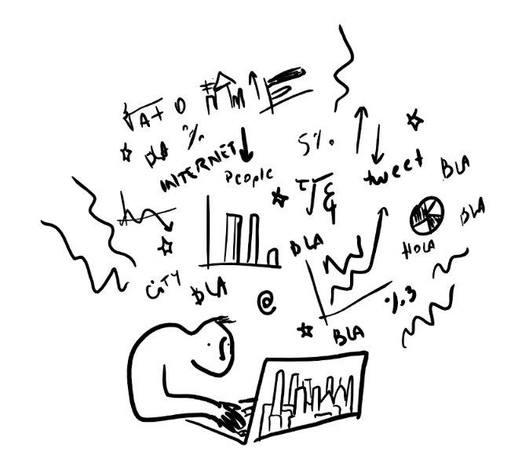

## Ciencia de Datos para Gente Sociable

### Una introducción a la exploración, análisis y visualización de datos
#### *Antonio Vazquez Brust*

 
Este es un repositorio de los ejercicios practicos que se pueden encontrar en el libro Ciencia de Datos para Gente Sociable escrito por Antonio Vazquez Brust.

 

#### **Libro**

<a href="https://bitsandbricks.github.io/ciencia_de_datos_gente_sociable/">https://bitsandbricks.github.io/ciencia_de_datos_gente_sociable/</a>
